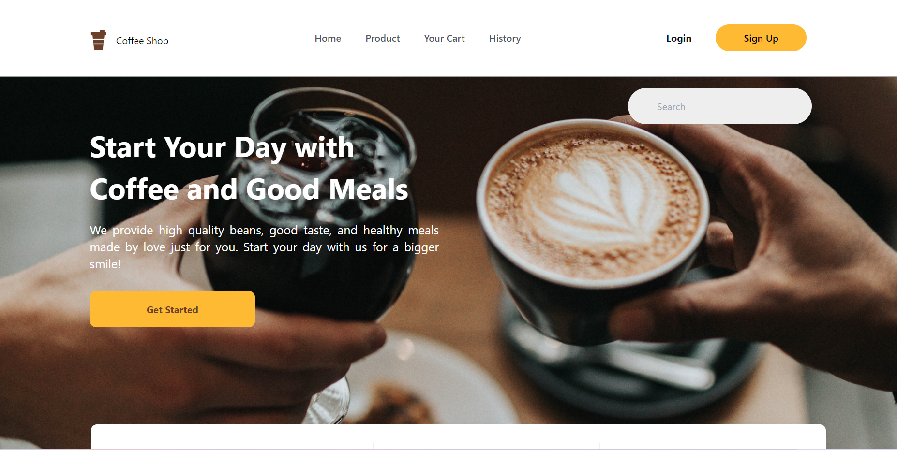
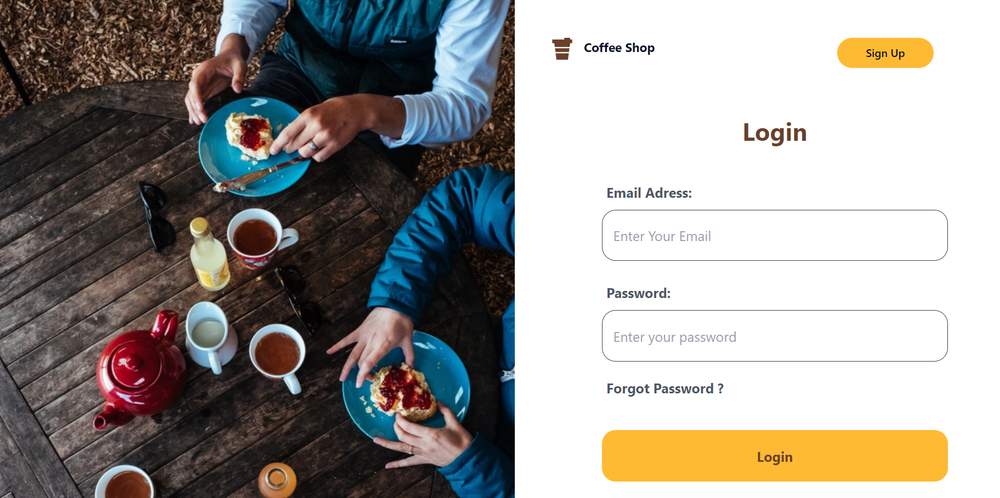
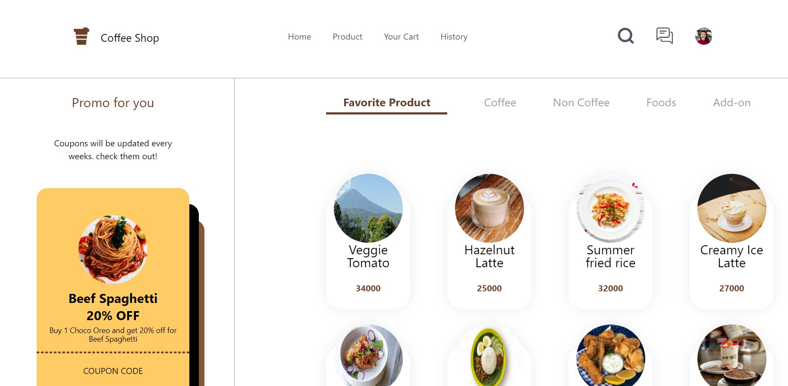
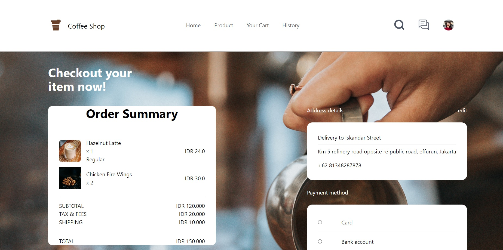

  <h2 align="center">Coffee Shop</h2>

 

  

    <a href="https://coffee-shop-front-end.vercel.app/">View Demo</a>
    ·
    <a href="mailto:raihanirvana13@gmail.com">Report Bug</a>
    ·
    <a href="mailto:raihanirvana13@gmail.com">Request Feature</a>
  

## Coffee Shop

Coffee Shop is a web-based application for buying online coffee.

## Build With

This application is built using React.js, , Redux, axios, Lodash, Chart.js, React-Pin-Field, TailwindCSS, and DaisyUI.

## Features

### Public

- Login
- Register
- Forgot Password
- Buy Coffee
- Online Payment
- Edit Profile
- Etc

## How to run the application

To run the application, follow these steps:

1. Clone this repository to your computer.
2. Open a terminal in the repository directory and run the `npm install` command to install all required dependencies.
3. After it finishes, run the `npm run dev` command to run the application.
4. Open a browser and visit `http://localhost:3000` to see the application.

## Contributions

If you would like to contribute to this project, please send a pull request to this repository. We greatly appreciate your contributions.

## Documentation

